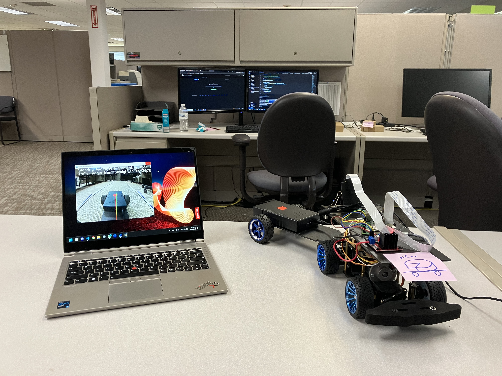
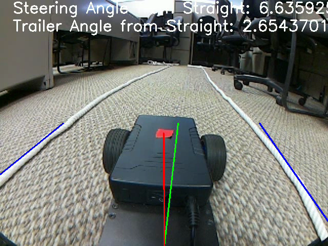

# TrailerBackerUpper

This project contains Python source code for a manually and autonomously controlled 1/10th scale truck with a trailer.
> Also see software documentation.

## Table of Contents
- [Documentation](https://cschwarz68.github.io/TrailerBackerUpper/)
- [General Info](#general-information)
- [Technologies Used](#technologies-used)
- [Project Status](#project-status)
- [Acknowledgements](#acknowledgements)

## General Information
We're developing a 1/10th scale truck with a trailer that can be used to demonstrate autonomous navigation with a camera. It can work in both forward and reverse and navigate on a one lane road. It can also be controlled manually with a game controller. Autonomous navigation is guided using two lanes lines on both sides of the vehicle which contrast with the ground.

## Technologies Used
- Seeed Studio vehicle chassis.
- Raspberry Pi 4 Model B.
- Raspberry Pi Camera
- Python 3.9.2.
> See software documentation for more info.

## Project Status
The vehicle can autonomously navigate forward. The current goal is to finish implementing model predictive control for reverse driving. The current obstacles to this goal are image processing and performance related. Please see this repositories GitHub pages site for general information, and documentation in each file source for more specific information..

## Acknowledgements
- Bill Chen (Workplace Learning Connection intern)
- Bivan Shrestha (Workplace Learning Connection intern)
- Raven Levitt (Workplace Learning Connection intern)
- Tommy Rogers (Workplace Learning Connection intern)
- Marcus Miller (Workplace Learning Connection intern)
- Kyle Chi (Workplace Learning Connection intern)
- Alan Ramirez (UIowa engineering)
- Adithya Mukundan (UIowa CS)
- Amol Bhagavathi (UIowa CS)
- Christopher Nair (UIowa CS)
- [Image Processing for Autonomous Driving - David Tian](https://github.com/dctian/DeepPiCar)  
- [Live Video Feed Streaming - An Nguyen](https://github.com/ancabilloni/udp_camera_streaming)
