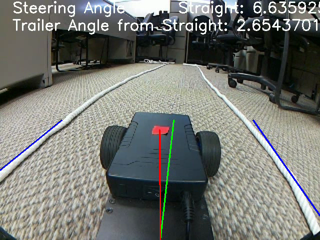

# TrailerBackerUpper

This project contains Python source code for a manually and autonomously controlled 1/10th scale truck with a trailer.
> Also see software documentation.

## Table of Contents
- [General Info](#general-information)
- [Technologies Used](#technologies-used)
- [Project Status](#project-status)
- [Acknowledgements](#acknowledgements)

## General Information
We're developing a 1/10th scale truck with a trailer that can be used to demonstrate autonomous navigation with a camera. It can work in both forward and reverse and navigate on a one lane road. It can also be controlled manually with a game controller. Autonomous navigation is guided using two lanes lines on both sides of the vehicle which contrast with the ground.

## Technologies Used
- Seeed Studio vehicle chassis.
- Raspberry Pi 4 Model B.
- Raspberry Pi Camera
- Python 3.9.2.
> See software documentation for more info.

## Project Status
The vehicle can autonomously navigate forward. Autonomous reverse navigation functions with a straight lane, but still has room for improvement when the lane greatly curves.  
Currently, a planned neural network was trained for forward navigation, but the models are now insufficient. We have plans to implement machine learning later.

## Acknowledgements
- [Image Processing for Autonomous Driving - David Tian](https://github.com/dctian/DeepPiCar)  
- [Live Video Feed Streaming - An Nguyen](https://github.com/ancabilloni/udp_camera_streaming)
